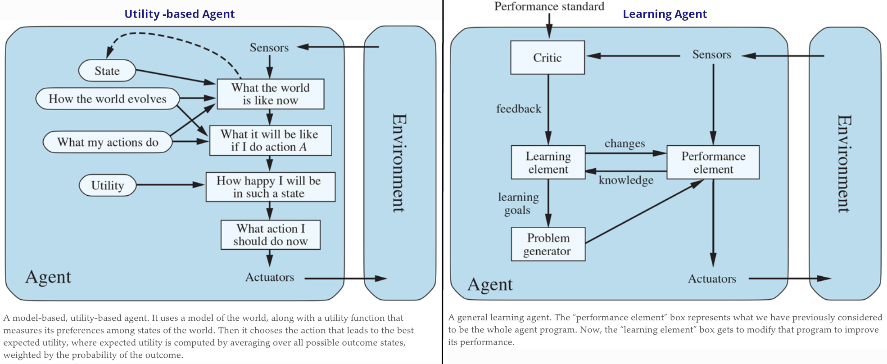

# BrainOS

Pluming an architecture based on Huggingface models and api's for making artificial awareness.

pip install transformers datasets

python
from BrainOS import *

OS = BrainOS()
OS.iamlive("I want to travel to Italy, how about you?")

An rough idea about the software architecture:

