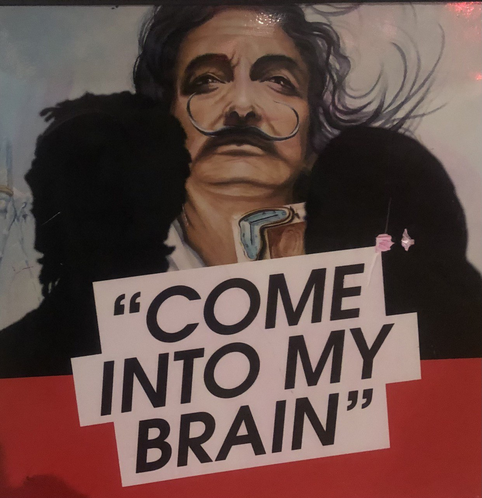

# BrainOS

Pluming an architecture by [huggingface](https://huggingface.co/) models and api's for making artificial awareness.

`pip install transformers datasets`

`python`

`from BrainOS import *`

`OS = BrainOS()`

`OS.iamlive("I want to travel to Italy, how about you?")`

An rough idea about the software architecture:

Todo:

  - a flask interface

  - a short memory with summarization (done)

  - better choice of "points of view" and "impacts" based on similarty (done)

  - inner dialog (done) 
